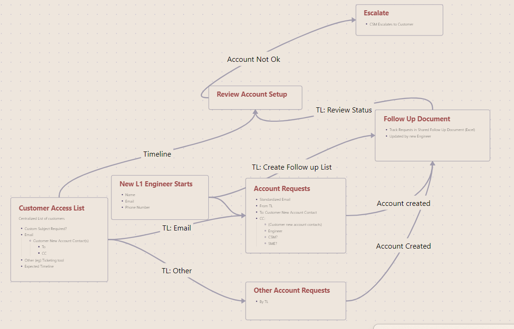

# Process

# Process Description 

## Prerequisites
### Customer Access List
- **Initial Setup by TL L1** based on existing documentation
- **Maintained by ??**
- Centralized list of customers.    
    - Contact person(s) for new account requests. (For email, define fields To and CC)
	    - Customer
	    - CC
    - Communication method (email or ticketing tool).
	    - Specific Requirements (e.g. Custom Subject in the email)
	- Other Specific Requirements
    - Expected timeline for account creation.
        
### Engineer Profile

- Name
- Email
- Contact Number

## Account Request Submission

**Responsible:** Team Lead (TL)

- **Create Account Requests**:
    - Send a standardized email to the customer’s new account contact. (See [[#Automation|Automation]])
    - Include relevant CCs (Engineer, CSM, SME as needed).
        
- **Track Requests**:
    - Create the **Follow-Up Document** (Excel).
	    - Use Template
    - Include request date
        
## Account Setup & Verification

**Responsible:** New Engineer & TL
- Engineer logs in to verify account access
    - If **account is set up correctly**, update the Follow-Up Document.
    - If **account is not functional**, Escalate to TL

## Monitoring & Follow-Up

**Responsible:** Team Lead & New Engineer

- New engineer updates the Follow-Up Document with account status.
- TL reviews the progress and ensures pending requests are addressed
- If no response is received within the expected timeline / account setup takes too long according to the timeline    
    - **Escalation**: Team Lead escalates to CSM to follow up with the customer.
        

## Escalation

**Responsible:** CSM

- If an account is not set up within the required timeline, escalate to the customer contact.
- Follow up on critical cases that may impact work start dates.
    

# Responsibilities

| **Role**           | **Responsibilities**                                                                   |
| ------------------ | -------------------------------------------------------------------------------------- |
| **Team Lead (TL)** | - Maintain customer access list- Submit account requests- Track progress and follow up |
| **New Engineer**   | Complete account setup - Update Follow-Up Document- Test access when account is ready  |
| **CSM**            | - Escalate unresolved issues to customers                                              |

# Automation

- **Automate account requests**: Mail Merge    

# Remarks

- We should not create accounts before the engineer has started
	- Sharing Personal Info
	- Account and Email Setup is required (InteralIT)
- I don't believe Xurrent is a good way to track the progress. We could create a single ticket, referencing the follow up document. Maybe we can use it for escalations?